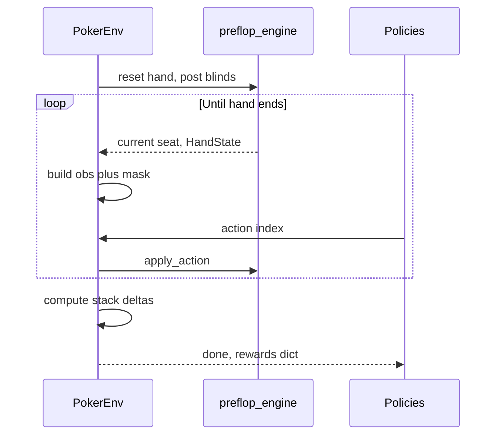

# RL-ready poker environment (multi-seat, fixed action mask)

**Status:** design only — implement later.

**Source:** agreed design (multi-agent parallel, fixed masked action space, stack-delta rewards).

---

## Six agents, seat rotation, same rules

- **Six fixed learner identities** `P1`–`P6` (or `agent_0`–`agent_5`). Each has its **own** Q-table or network weights (not shared across identities).
- **Each hand:** same table rules as today (blinds, streets, raises, side pots, bust-out, etc.). After the hand, **rotate seating** one step forward (same mapping as current `run_one_hand`: UTG→BB chain so each physical `Pi` sits a new `POSITION` next hand). **Stacks carry over**; busted players skip until eliminated from the session or reset.
- **Training loop:** one env step = one acting decision for whoever’s turn it is; the policy queried is the agent **currently seated** at that position (lookup via `seating[position] → player_id`).

---

## Goals

- Replace random `choose_random_action` usage with an **environment** that exposes:
  - **Observation** per acting seat: encoded hand, seat/position, stack, pot, street, and **fixed-size legal action mask**
  - **Fixed discrete action space** with masking
- **Multi-agent (6 learners):** all six seats controlled by RL agents with **distinct** explore–exploit settings (see below); on a seat’s turn the env returns that seat’s obs and the corresponding agent picks an action index.
- **Reward (v1):** at hand end, for each player `reward = stack_after - stack_before` for that hand (net won/lost including blinds and payouts). Optional later: shaped rewards per street.

---

## Key design decisions

### Fixed action set (suggested dimension ~8)

Map engine legals into indices; illegal actions masked:

| Index | Meaning | When legal |
|------:|---------|--------------|
| 0 | `fold` | When facing bet; also when `to_call==0` if that rule is kept |
| 1 | `call` | `to_call > 0` |
| 2 | `check` | `to_call == 0` |
| 3 | `raise_preflop_3x` | Preflop only, if `min_raise_to` reachable |
| 4 | `raise_postflop_pot_50` | Postflop, unopened, if target legal |
| 5 | `raise_postflop_pot_75` | Postflop, unopened, if target legal |
| 6 | `raise_postflop_2x_facing` | Postflop, facing bet, if target legal |
| 7 | `all_in` (optional) | Explicit all-in; else omit and rely on call/raise caps |

Implementation detail: each index maps to the **closest** engine `Action` or the exact target already computed in `sim/preflop_engine.py` (`get_legal_actions`, `_flop_raise_targets`, `min_raise_to`). If multiple legal raises exist, indices 4–6 pick the matching line; if none, mask off.

### Observation (per acting player)

Keep human-readable dict first (easy RL debugging); add numpy vector later.

Suggested dict fields:

- `player_id` / `position` (string)
- `street` (`preflop` | `flop` | `turn` | `river`)
- `stack` (float), `pot` (float)
- `to_call` (float) for this seat
- `hole_cards`: two `(rank, color)` tuples or compact encoding
- `board`: 0–5 cards same format
- `legal_actions_mask`: list[bool] or `List[int]` 0/1 length `ACTION_DIM`
- `action_meanings`: static list of strings (for logging)

Encoding v1: **tabular** ranks `0..12` × suits `0..3` for hole + board padded to 5 with `-1` sentinels (simple for RL tabular / small MLP).

### Environment API (minimal)

New module e.g. `sim/poker_env.py` (or `rl/poker_env.py`):

- `reset(starting_stacks_by_player_id, seating)` → initial `info` for all seats (stacks); internal `HandState` from `initialize_hand` in `sim/preflop_engine.py` as needed
- `step(action_index)` → advances until **next decision** for a controlled seat **or** hand ends
- Returns: `obs`, `rewards` (dict seat→float, all zeros mid-hand), `done`, `info`
- On `done=True`, fill `rewards` with **stack deltas** captured at `reset` vs after payout (reuse fold-win payout and side-pot showdown logic currently in `sim/run_one_hand.py`: `_award_pot_to_winner_if_any`, `_settle_showdown`)

**Turn order:** reuse engine order inside `run_betting_round`. With six RL agents, every decision is one of the six policies (selected by current `position` → `player_id` via seating map).

### Integration with existing code

- **Reuse:** `HandState`, `get_legal_actions`, `apply_action`, `run_*_round`, `can_players_bet`, `total_contribution` / `summarize_hand` in `sim/preflop_engine.py`.
- **Refactor lightly:** extract “play one hand until next decision” from `sim/run_one_hand.py` into the env so `run_one_hand` can become a thin demo (random vs RL).
- **Do not** duplicate side-pot math: call existing `_settle_showdown` path or move showdown to shared `sim/showdown.py` only if both runner and env need it (optional cleanup).

### Files to add/change

| File | Change |
|------|--------|
| `sim/poker_env.py` | New `PokerEnv`: state, mask, step, rewards |
| `sim/preflop_engine.py` | Optional: `get_current_actor()` helper; ensure `total_contribution` reset per new hand |
| `sim/run_one_hand.py` | Optional: `--mode random\|rl` stub loop |

### Reward definition (explicit)

At hand start, snapshot `stack0[player_id]`. After all payouts (fold win or showdown with side pots), `reward[player_id] = stack_final[player_id] - stack0[player_id]`.

### Out of scope (later)

- Opponent modeling, ICM, curriculum, vectorized env
- Automated tests (optional per project preference)

---

## Suggested initial / simple RL model

**Start with tabular Q-learning + epsilon-greedy** (masked illegal actions):

- **Why it fits:** discrete `ACTION_DIM`, moderate state if you **abstract** cards (e.g. bucket stack/pot/`to_call`, street, position, and **abstraction** of hole/board such as hand-strength category + texture flags) to keep the table finite. Full raw card product is huge; tabular needs abstraction or a function approximator.
- **Update:** after each hand (or each step if you store transitions), standard Q update on `(s, a)` with reward only at terminal time-step (Monte Carlo) or use **n-step / per-decision** bootstrapping with `next_q = max_{a' legal} Q(s', a')` masked by legality at `s'`.

**Step up when tabular is too coarse:** small **MLP DQN** (2–3 layers, 128–256 units) on a **fixed-length vector** obs (encoded cards + position one-hot + normalized stack/pot/to_call + street one-hot + mask as extra inputs or applied only at the output layer by masking Q-values before `argmax`).

**Not recommended first:** PPO/A3C on full self-play (heavy tuning), CFR (different paradigm), Transformers.

**Non-stationarity:** six simultaneous learners make the env non-stationary; that is expected. Logging **per-agent** cumulative reward / bankroll over hands and comparing epsilon curves is still meaningful for a first study.

---

## Six different epsilons (explore vs exploit)

Assign each agent `Pi` a fixed **initial** epsilon for comparison, e.g.:

| Agent | ε₀ (example) | Role |
|-------|----------------|------|
| P1 | 0.05 | mostly exploit |
| P2 | 0.10 | |
| P3 | 0.20 | |
| P4 | 0.30 | |
| P5 | 0.50 | balanced |
| P6 | 0.80 | mostly explore |

**Epsilon is static for now:** no decay per hand or over time; each agent keeps its fixed `ε₀` for the whole run (easy comparison across the six curves).

**Action selection:** with probability `ε`, choose **uniformly among legal actions only** (respect mask); with `1−ε`, `argmax_a Q(s,a)` over legal `a` only.

---

## Data flow

---

## Implementation checklist

1. Define `ACTION_DIM`, mapping, and `legal_mask(hand_state, seat)` next to `get_legal_actions`.
2. Implement `PokerEnv` with `reset` / `step` and stack-delta rewards.
3. Add `sim/rl_train.py` (or similar): **six** `EpsilonGreedyAgent` instances (same Q-table size / same net architecture), each with its own `ε`; seating rotation + stack carryover each hand; log per-agent bankroll / mean reward per N hands.
4. (Optional) Export obs as numpy for PyTorch; swap tabular dict for MLP when ready.

---

## Implementation todos (tracking)

- [ ] **action-space:** Define fixed `ACTION_DIM`, string labels, map from `get_legal_actions` to mask + chosen `Action`.
- [ ] **obs-builder:** Implement obs dict (position, street, stack, pot, to_call, encoded cards, mask) from `HandState` + seating.
- [ ] **poker-env:** Add `sim/poker_env.py`: reset, step until next RL seat or terminal, snapshot stacks for rewards.
- [ ] **reward-delta:** On hand end, `rewards[player_id] = stack_after - stack_before` after fold win or side-pot showdown.
- [ ] **six-agents-rotation:** Wire 6 policies to 6 seats; rotate `seating` after each hand; busted agents masked out of play.
- [ ] **epsilon-sweep:** Six agents with distinct **fixed** `ε` (no decay); log/compare curves (bankroll vs hands).
